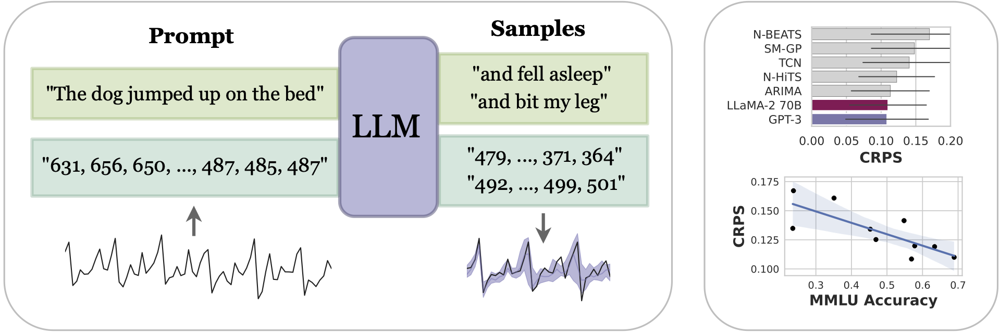

# Large Language Models Are Zero Shot Time Series Forecasters

<figure>
  
  <figcaption> Proposing <em>LLMTime</em>, a method for <em>zero-shot</em> time series forecasting with large language models (LLMs) by encoding numbers as text and sampling possible extrapolations as text completions. LLMTime can outperform many popular timeseries methods without any training on the target dataset (i.e. zero shot). The performance of LLMTime also scales with the power of the underlying base model. However, models that undergo alignment (e.g. RLHF) do not follow the scaling trend. For example, GPT-4 demonstrates inferior performance to GPT-3. </figcaption>
</figure>

## Installation
Run the following command to install all dependencies in a conda environment named `llmtime`. Change the cuda version for torch if you don't have cuda 11.8. 
```
source install.sh
```
After installation, activate the environment with
```
conda activate llmtime
```
If you prefer not using conda, you can also install the dependencies listed in `install.sh` manually. 

If you want to run OpenAI models through their API (doesn't require access to a GPU), add your openai api key to `~/.bashrc` with
```
echo "export OPENAI_API_KEY=<your key>" >> ~/.bashrc
```

Finally, if you have a diffferent OpenAI API base, change it in your `~/.bashrc` with
```
echo "export OPENAI_API_BASE=<your base url>" >> ~/.bashrc
```

## Trying out LLMTime
Run the quick demo in the `demo.ipynb` notebook. No GPUs required!

## Plugging in other LLMs
Currently supported are GPT-3, GPT-3.5, GPT-4, Mistral, and LLaMA 2. It's easy to plug in other LLMs by simply specifying how to generate text completions from them in `models/llms.py`.

To run Mistral models, add your mistral api key to `~/.bashrc` with
```
echo "export MISTRAL_KEY=<your key>" >> ~/.bashrc
```

## Tips 
Here are some tips for using LLMTime:
- Performance is not too sensitive to the data scaling hyperparameters `alpha, beta, basic`. A good default is `alpha=0.95, beta=0.3, basic=False`. For data exhibiting symmetry around 0 (e.g. a sine wave), we recommend setting `basic=True` to avoid shifting the data.
- The recently released `gpt-3.5-turbo-instruct` seems to require a lower temperature (e.g. 0.3) than other models, and tends to not outperform `text-davinci-003` from our limited experiments.
- Tuning hyperparameters based on validation likelihoods, as done by `get_autotuned_predictions_data`, will often yield better test likelihoods, but won't necessarily yield better samples. 

## Experiments
Run the following commands to experiment. The outputs will be saved in `./outputs/`. You can use `visualize.ipynb` to visualize the results. Precomputed outputs are provided in `./precomputed_outputs/`.
### Darts
```
python -m experiments.run_darts
```
### Monash
You can download preprocessing data from [here](https://drive.google.com/file/d/1XluceU_MdRJbU2rfdKSaMsKb7NqdRx-m/view?usp=sharing) or use the following command
```
gdown 'https://drive.google.com/file/d/1XluceU_MdRJbU2rfdKSaMsKb7NqdRx-m/view?usp=drive_link'
```
Then extract the data (the extracted data will be in `./datasets/monash/`)
```
tar -xzvf monash.tar.gz
```
Then run the experiment
```
python -m experiments.run_monash
```
### Synthetic
```
python -m experiments.run_synthetic
```
### Missing values
```
python -m experiments.run_missing
```
### Memorization
```
python -m experiments.run_memorization
```
